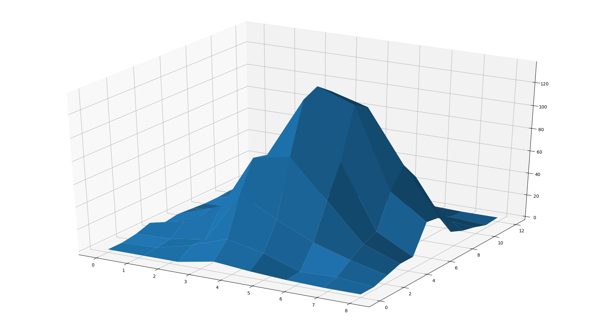
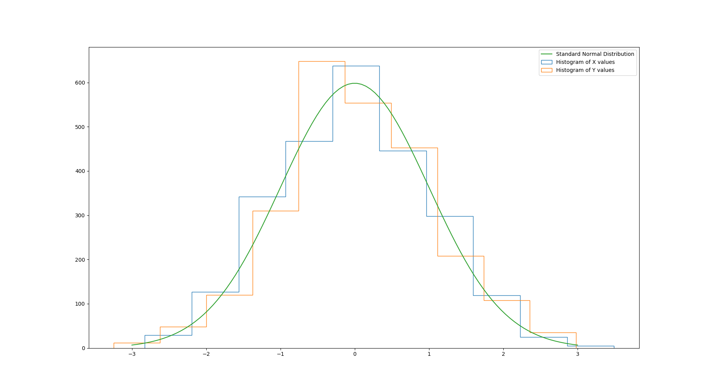

# Pozyx Localization
C++ (and Arduino) code to read and visualize data from a Pozyx device

This repository contains code written in C++ to visualize location of a calibrated pozyx device.

## Dependencies
`OpenCV` is the only dependency required to build and run this code.

## Building and running the source code
Clone the repository using `git clone https://github.com/surgeonofdeath/pozyxLocalization.git`

Navigate to the cloned directory using `cd pozyxLocalization/`

Build the code using `mkdir build && cd build/ && cmake .. && make; cd ..`

Run the built code using `cd bin/ && sudo ./demo; cd ..`

_NOTE:_ `sudo` is required if the user is not added to the dialout group (i.e., the group with serial port permissions).

## Calibrating the pozyx device
Please refer to the documentation on the pozyx website on how to calibrate the pozyx device and anchors at https://www.pozyx.io/Documentation

## Statistics on device position

 

The above figures show that when stationary, the position noise of the device follows a gaussian distribution.

Detailed documentation can be found in [Pozyx Documentation file](https://github.com/surgeonofdeath/pozyxLocalization/blob/master/Pozyx%20Documentation.pdf).

